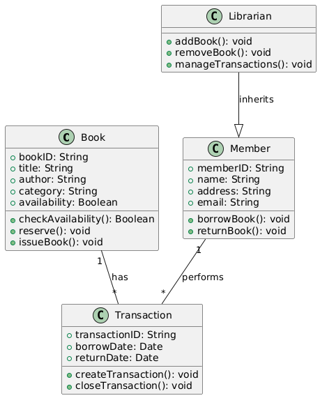
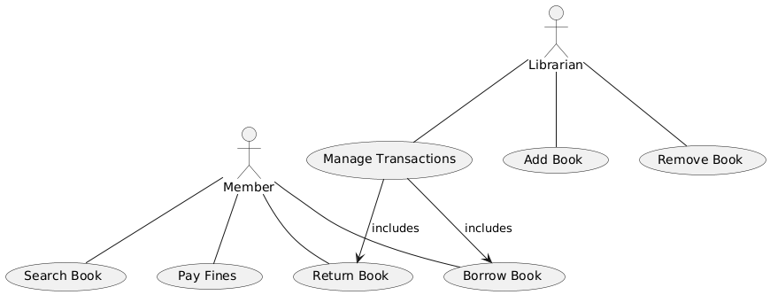

# Exercise 02

## Drawing Class Diagram and Use Case Diagram of Library Management System

### Aim  

To draw the Class Diagram and Use Case Diagram for a Library Management System.

### Theory

- **Class Diagram**: The class diagram is a structural diagram that shows the static structure of a system by representing its classes, their attributes, methods, and relationships such as associations, inheritance, and dependencies.
  
- **Use Case Diagram**: A use case diagram represents the functional requirements of a system. It shows the interactions between users (actors) and the system, capturing the system's functionality as "use cases."

In the context of a Library Management System, the class diagram would represent the system's entities like books, users, and transactions, while the use case diagram would depict actions such as borrowing, returning books, and searching for books.

### Procedure/Program

1. **Class Diagram**:
   - Identify the main components of the Library Management System: `Book`, `Member`, `Transaction`, `Librarian`, etc.
   - Draw the classes and their attributes:
     - `Book`: Attributes like `bookID`, `title`, `author`, `category`, `availability`.
     - `Member`: Attributes like `memberID`, `name`, `address`, `email`.
     - `Transaction`: Attributes like `transactionID`, `borrowDate`, `returnDate`, `book`.
   - Define the relationships:
     - Association between `Book` and `Transaction` (a book can be part of multiple transactions).
     - Association between `Member` and `Transaction` (a member can have multiple transactions).
     - Inheritance (if applicable, such as `Librarian` being a subclass of `Member`).
   - Specify operations (methods) for each class:
     - `Book`: Methods like `checkAvailability()`, `reserve()`, `issueBook()`.
     - `Member`: Methods like `borrowBook()`, `returnBook()`.
     - `Transaction`: Methods like `createTransaction()`, `closeTransaction()`.

2. **Use Case Diagram**:
   - Identify actors in the system: `Member`, `Librarian`.
   - Identify use cases:
     - `Search Book`, `Borrow Book`, `Return Book`, `Pay Fines` for `Member`.
     - `Add Book`, `Remove Book`, `Manage Transactions` for `Librarian`.
   - Draw the system boundary and connect the actors to their respective use cases.
   - Represent the relationships:
     - `Member` interacts with `Search Book`, `Borrow Book`, `Return Book`, etc.
     - `Librarian` manages books and transactions.
     - Use generalization or inclusion for actions that may have common behavior (e.g., `Manage Transactions` may include `Issue Book` and `Return Book`).

### Output/Explanation

- **Class Diagram**:
  - The output will be a class diagram that shows the structure of the system, including classes, their attributes, methods, and the relationships between them.

- **Use Case Diagram**:
  - The output will be a use case diagram illustrating the interactions between the system's actors and the use cases, representing the library system's functionality.

Explanation:

- The **Class Diagram** visually captures the structure of the Library Management System by focusing on the static elements like classes, their relationships, and attributes.
  
- The **Use Case Diagram** provides a high-level overview of the system's functionality, showing the interactions between users and the system's features.
