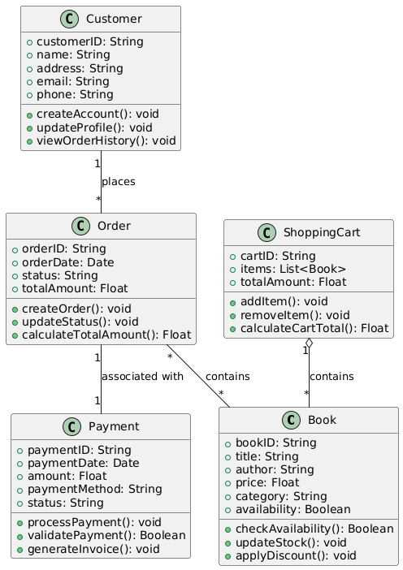
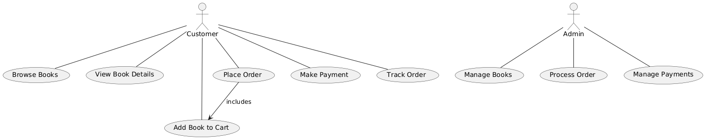

# Exercise 03

## Drawing Class Diagram and Use Case Diagram of Online Book Shop

### Aim  

To draw the Class Diagram and Use Case Diagram for an Online Book Shop.

### Theory

- **Class Diagram**: A class diagram is a structural diagram in UML (Unified Modeling Language) that shows the static structure of a system. It represents classes, their attributes, methods, and the relationships between them, such as associations, inheritance, and dependencies.

- **Use Case Diagram**: A use case diagram is a behavioral diagram in UML that captures the functional requirements of a system by showing the interactions between users (actors) and the system, represented as use cases.

For an Online Book Shop, the class diagram would include entities like `Book`, `Customer`, `Order`, `ShoppingCart`, and `Payment`, while the use case diagram would represent user interactions such as browsing books, placing an order, and making payments.

### Procedure/Program

1. **Class Diagram**:
   - **Identify the main components of the Online Book Shop**:
     - `Book`: Attributes like `bookID`, `title`, `author`, `price`, `category`, `availability`.
     - `Customer`: Attributes like `customerID`, `name`, `address`, `email`, `phone`.
     - `Order`: Attributes like `orderID`, `orderDate`, `status`, `totalAmount`.
     - `ShoppingCart`: Attributes like `cartID`, `items`, `totalAmount`.
     - `Payment`: Attributes like `paymentID`, `paymentDate`, `amount`, `paymentMethod`, `status`.

   - **Define relationships**:
     - Association between `Customer` and `Order` (a customer can place multiple orders).
     - Association between `Order` and `Book` (an order can have multiple books).
     - Aggregation between `ShoppingCart` and `Book` (a shopping cart contains multiple books).
     - Association between `Payment` and `Order` (an order can have a payment associated with it).

   - **Specify operations (methods)**:
     - `Book`: Methods like `checkAvailability()`, `updateStock()`, `applyDiscount()`.
     - `Customer`: Methods like `createAccount()`, `updateProfile()`, `viewOrderHistory()`.
     - `Order`: Methods like `createOrder()`, `updateStatus()`, `calculateTotalAmount()`.
     - `ShoppingCart`: Methods like `addItem()`, `removeItem()`, `calculateCartTotal()`.
     - `Payment`: Methods like `processPayment()`, `validatePayment()`, `generateInvoice()`.

2. **Use Case Diagram**:
   - **Identify actors in the system**:
     - `Customer`: The user who browses books, adds books to the cart, places an order, and makes payments.
     - `Admin`: The user who manages book inventory and handles orders.

   - **Identify use cases**:
     - For `Customer`: `Browse Books`, `View Book Details`, `Add Book to Cart`, `Place Order`, `Make Payment`, `Track Order`.
     - For `Admin`: `Manage Books`, `Process Order`, `Manage Payments`.

   - **Draw the system boundary**:
     - Draw a rectangle to represent the system's boundary and place the use cases inside it.
     - Connect the actors (`Customer`, `Admin`) to the use cases they interact with.
     - Use relationships like `include` or `extend` if there are actions that depend on others, e.g., `Place Order` may include `Add Book to Cart`.

### Output/Explanation

- **Class Diagram**:
  - The output will be a class diagram showing the structure of the Online Book Shop system, with classes, their attributes, methods, and relationships such as associations, aggregations, and dependencies.

- **Use Case Diagram**:
  - The output will be a use case diagram that shows the interactions between the `Customer` and `Admin` actors with various use cases like browsing books, placing orders, and processing payments.

Explanation:

- The **Class Diagram** provides a detailed, static view of the system's entities and their relationships. It helps in understanding how the system is structured and how different components interact.
  
- The **Use Case Diagram** illustrates the system's functionality and user interactions, providing a high-level overview of what the system allows users to do, helping developers understand user requirements and interactions.
