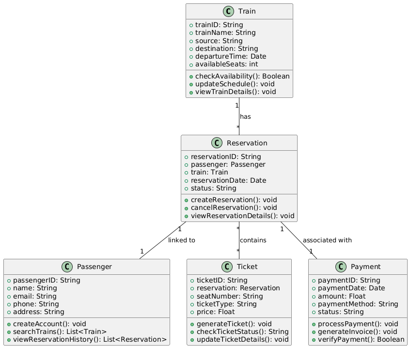
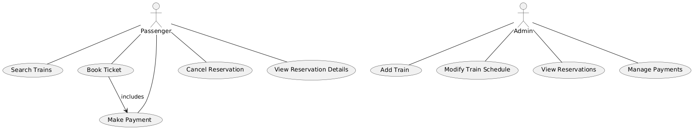

# Exercise 04

## Drawing Class Diagram and Use Case Diagram of Railway Reservation System

### Aim  

To draw the Class Diagram and Use Case Diagram for a Railway Reservation System.

### Theory

- **Class Diagram**: A class diagram is a static structure diagram in UML that shows the system's classes, their attributes, methods, and relationships. It is used to model the system's internal structure.

- **Use Case Diagram**: A use case diagram captures the functional requirements of a system by depicting the interactions between users (actors) and the system, represented as use cases.

For a Railway Reservation System, the class diagram will represent entities like `Train`, `Reservation`, `Passenger`, `Payment`, and `Ticket`. The use case diagram will depict interactions such as searching for trains, booking tickets, and making payments.

### Procedure/Program

1. **Class Diagram**:
   - **Identify the main components of the Railway Reservation System**:
     - `Train`: Attributes like `trainID`, `trainName`, `source`, `destination`, `departureTime`, `availableSeats`.
     - `Reservation`: Attributes like `reservationID`, `passenger`, `train`, `reservationDate`, `status`.
     - `Passenger`: Attributes like `passengerID`, `name`, `email`, `phone`, `address`.
     - `Ticket`: Attributes like `ticketID`, `reservation`, `seatNumber`, `ticketType`, `price`.
     - `Payment`: Attributes like `paymentID`, `paymentDate`, `amount`, `paymentMethod`, `status`.

   - **Define relationships**:
     - Association between `Train` and `Reservation` (a train can have multiple reservations).
     - Association between `Reservation` and `Passenger` (a reservation is linked to a passenger).
     - Association between `Reservation` and `Ticket` (a reservation can have one or more tickets).
     - Association between `Payment` and `Reservation` (payment is linked to a reservation).

   - **Specify operations (methods)**:
     - `Train`: Methods like `checkAvailability()`, `updateSchedule()`, `viewTrainDetails()`.
     - `Passenger`: Methods like `createAccount()`, `searchTrains()`, `viewReservationHistory()`.
     - `Reservation`: Methods like `createReservation()`, `cancelReservation()`, `viewReservationDetails()`.
     - `Ticket`: Methods like `generateTicket()`, `checkTicketStatus()`, `updateTicketDetails()`.
     - `Payment`: Methods like `processPayment()`, `generateInvoice()`, `verifyPayment()`.

2. **Use Case Diagram**:
   - **Identify actors in the system**:
     - `Passenger`: The primary user who searches for trains, makes reservations, and processes payments.
     - `Admin`: The user who manages the trains, schedules, and reservations.

   - **Identify use cases**:
     - For `Passenger`: `Search Trains`, `Book Ticket`, `Make Payment`, `Cancel Reservation`, `View Reservation Details`.
     - For `Admin`: `Add Train`, `Modify Train Schedule`, `View Reservations`, `Manage Payments`.

   - **Draw the system boundary**:
     - Draw a rectangle to represent the system's boundary and place the use cases inside it.
     - Connect the actors (`Passenger`, `Admin`) to the use cases they interact with.
     - Use relationships such as `include` or `extend` for actions that depend on others. For example, `Book Ticket` may include `Make Payment`.

### Output/Explanation

- **Class Diagram**:
  - The output will be a class diagram illustrating the system's classes, attributes, methods, and the relationships between entities like `Train`, `Reservation`, `Passenger`, `Ticket`, and `Payment`.

- **Use Case Diagram**:
  - The output will be a use case diagram showing how the `Passenger` and `Admin` actors interact with the system through use cases like searching trains, booking tickets, and managing payments.

Explanation:

- The **Class Diagram** provides a detailed structural view of the Railway Reservation System, showing how different entities relate to each other, which helps in understanding the internal working of the system.
  
- The **Use Case Diagram** represents a high-level view of the system's functionalities from the user's perspective, capturing the interactions between users and the system’s features.
