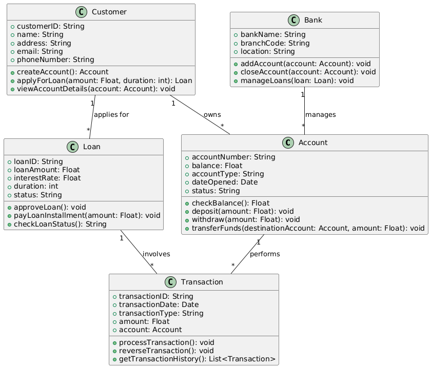
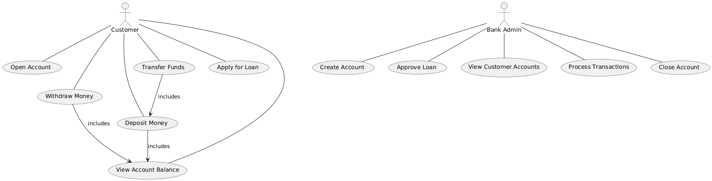

# Exercise 05

## Drawing Class Diagram and Use Case Diagram of Banking System

### Aim  

To draw the Class Diagram and Use Case Diagram for a Banking System.

### Theory

- **Class Diagram**: A class diagram in UML represents the static structure of a system by showing its classes, their attributes, methods, and the relationships among them. In a banking system, it models entities like `Account`, `Transaction`, `Customer`, `Bank`, and `Loan`.

- **Use Case Diagram**: A use case diagram in UML represents the functional requirements of a system and shows the interactions between actors (users or external systems) and the system through use cases. For a banking system, use cases include actions like creating an account, transferring funds, and applying for a loan.

### Procedure/Program

1. **Class Diagram**:
   - **Identify the main components of the Banking System**:
     - `Account`: Attributes like `accountNumber`, `balance`, `accountType`, `dateOpened`, `status`.
     - `Transaction`: Attributes like `transactionID`, `transactionDate`, `transactionType`, `amount`, `account`.
     - `Customer`: Attributes like `customerID`, `name`, `address`, `email`, `phoneNumber`.
     - `Bank`: Attributes like `bankName`, `branchCode`, `location`.
     - `Loan`: Attributes like `loanID`, `loanAmount`, `interestRate`, `duration`, `status`.

   - **Define relationships**:
     - Association between `Customer` and `Account` (a customer can have multiple accounts).
     - Association between `Account` and `Transaction` (an account can have multiple transactions).
     - Aggregation between `Bank` and `Account` (a bank manages multiple accounts).
     - Association between `Customer` and `Loan` (a customer can apply for multiple loans).
     - Association between `Loan` and `Transaction` (loan payments may involve transactions).

   - **Specify operations (methods)**:
     - `Account`: Methods like `checkBalance()`, `deposit()`, `withdraw()`, `transferFunds()`.
     - `Transaction`: Methods like `processTransaction()`, `reverseTransaction()`, `getTransactionHistory()`.
     - `Customer`: Methods like `createAccount()`, `applyForLoan()`, `viewAccountDetails()`.
     - `Bank`: Methods like `addAccount()`, `closeAccount()`, `manageLoans()`.
     - `Loan`: Methods like `approveLoan()`, `payLoanInstallment()`, `checkLoanStatus()`.

2. **Use Case Diagram**:
   - **Identify actors in the system**:
     - `Customer`: The user who performs operations like opening accounts, depositing money, transferring funds, and applying for loans.
     - `Bank Admin`: The user who manages accounts, processes loan applications, and handles transactions.

   - **Identify use cases**:
     - For `Customer`: `Open Account`, `Deposit Money`, `Withdraw Money`, `Transfer Funds`, `Apply for Loan`, `View Account Balance`.
     - For `Bank Admin`: `Create Account`, `Approve Loan`, `View Customer Accounts`, `Process Transactions`, `Close Account`.

   - **Draw the system boundary**:
     - Draw a rectangle representing the system's boundary and place the use cases inside it.
     - Connect the actors (`Customer`, `Bank Admin`) to the use cases they interact with.
     - Use relationships such as `include` or `extend` where applicable. For example, `Deposit Money` may include `Check Balance` before allowing a deposit.

### Output/Explanation

- **Class Diagram**:
  - The output will be a class diagram showing the system's static structure, with classes representing `Account`, `Customer`, `Transaction`, `Bank`, and `Loan`, along with their attributes, methods, and relationships.

- **Use Case Diagram**:
  - The output will be a use case diagram showing how the `Customer` and `Bank Admin` actors interact with the banking system through various use cases like opening an account, transferring funds, and approving loans.

Explanation:

- The **Class Diagram** provides a structural view of the Banking System, representing its core entities and their relationships, which helps understand how the system is designed internally.
  
- The **Use Case Diagram** illustrates the system's functionalities from the user's perspective, showing how customers and bank administrators interact with the system to perform banking operations.
