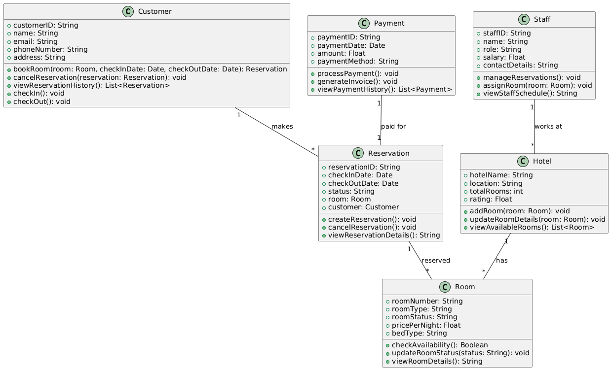
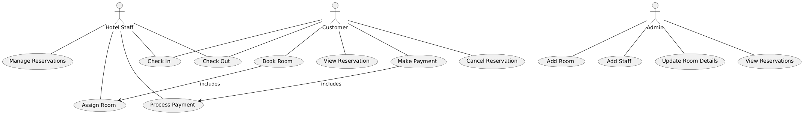

# Exercise 06

## Drawing Class Diagram and Use Case Diagram for Hotel Management System

### Aim  

To draw the Class Diagram and Use Case Diagram for a Hotel Management System.

### Theory

- **Class Diagram**: A class diagram represents the static structure of a system by showing its classes, their attributes, methods, and the relationships among them. In the case of a hotel management system, this would involve classes like `Customer`, `Room`, `Reservation`, `Payment`, `Staff`, and `Hotel`.

- **Use Case Diagram**: A use case diagram represents the functional requirements of a system and shows the interactions between users (actors) and the system through use cases. In a hotel management system, use cases include actions like booking a room, checking in, making payments, and managing reservations.

### Procedure/Program

1. **Class Diagram**:
   - **Identify the main components of the Hotel Management System**:
     - `Customer`: Attributes like `customerID`, `name`, `email`, `phoneNumber`, `address`.
     - `Room`: Attributes like `roomNumber`, `roomType`, `roomStatus`, `pricePerNight`, `bedType`.
     - `Reservation`: Attributes like `reservationID`, `checkInDate`, `checkOutDate`, `status`, `room`, `customer`.
     - `Payment`: Attributes like `paymentID`, `paymentDate`, `amount`, `paymentMethod`.
     - `Staff`: Attributes like `staffID`, `name`, `role`, `salary`, `contactDetails`.
     - `Hotel`: Attributes like `hotelName`, `location`, `totalRooms`, `rating`.

   - **Define relationships**:
     - Association between `Customer` and `Reservation` (a customer can have multiple reservations).
     - Association between `Room` and `Reservation` (a room can be reserved multiple times).
     - Association between `Payment` and `Reservation` (payment is linked to a reservation).
     - Association between `Staff` and `Hotel` (staff is associated with a hotel).
     - Aggregation between `Hotel` and `Room` (a hotel has many rooms).

   - **Specify operations (methods)**:
     - `Customer`: Methods like `bookRoom()`, `cancelReservation()`, `viewReservationHistory()`, `checkIn()`, `checkOut()`.
     - `Room`: Methods like `checkAvailability()`, `updateRoomStatus()`, `viewRoomDetails()`.
     - `Reservation`: Methods like `createReservation()`, `cancelReservation()`, `viewReservationDetails()`.
     - `Payment`: Methods like `processPayment()`, `generateInvoice()`, `viewPaymentHistory()`.
     - `Staff`: Methods like `manageReservations()`, `assignRoom()`, `viewStaffSchedule()`.
     - `Hotel`: Methods like `addRoom()`, `updateRoomDetails()`, `viewAvailableRooms()`.

2. **Use Case Diagram**:
   - **Identify actors in the system**:
     - `Customer`: The user who books rooms, checks in, makes payments, and views their reservations.
     - `Hotel Staff`: The user who manages reservations, assigns rooms, and processes check-ins.
     - `Admin`: The user who manages the overall hotel operations, such as adding rooms and staff.

   - **Identify use cases**:
     - For `Customer`: `Book Room`, `Cancel Reservation`, `Check In`, `Check Out`, `Make Payment`, `View Reservation`.
     - For `Hotel Staff`: `Assign Room`, `Manage Reservations`, `Check In`, `Check Out`, `Process Payment`.
     - For `Admin`: `Add Room`, `Add Staff`, `Update Room Details`, `View Reservations`.

   - **Draw the system boundary**:
     - Draw a rectangle representing the system’s boundary and place the use cases inside it.
     - Connect the actors (`Customer`, `Hotel Staff`, `Admin`) to the use cases they interact with.
     - Use relationships such as `include` or `extend` for actions that depend on others. For example, `Book Room` may include `Check Availability` before allowing a booking.

### Output/Explanation

- **Class Diagram**:
  - The output will be a class diagram showing the system's classes, including `Customer`, `Room`, `Reservation`, `Payment`, `Staff`, and `Hotel`, along with their attributes, methods, and relationships.

- **Use Case Diagram**:
  - The output will be a use case diagram illustrating the interactions between the actors (`Customer`, `Hotel Staff`, and `Admin`) and the hotel management system through use cases such as `Book Room`, `Assign Room`, and `Make Payment`.

Explanation:

- The **Class Diagram** provides a detailed structural view of the Hotel Management System, showing the internal design and relationships between different entities such as `Room`, `Reservation`, and `Customer`.

- The **Use Case Diagram** represents the system's functionalities from the user's perspective, capturing the interactions between customers, staff, and admins with the hotel management system.
