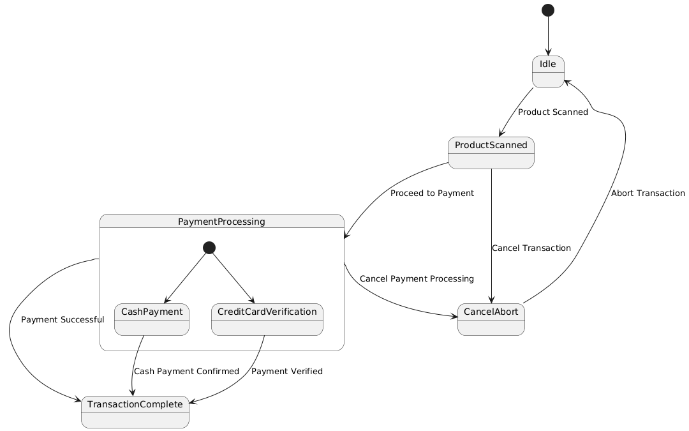

# Exercise 07

## Drawing State Chart Diagram for Point of Sale (POS) System

### Aim  

To draw the State Chart Diagram for a Point of Sale (POS) System.

### Theory

A **State Chart Diagram** (also known as a State Machine Diagram) in UML represents the states an object can be in, along with the events that cause a transition between states. It is used to model the dynamic behavior of a system.

For a **Point of Sale (POS) System**, the diagram represents the different states a transaction can go through, from the moment the POS system is powered on until the transaction is completed. This includes states like "Idle", "Product Scanned", "Payment Processing", and "Transaction Complete".

### Procedure/Program

1. **Identify States**:
   - **Idle**: The initial state of the POS system, waiting for an action from the user (e.g., a product scan).
   - **Product Scanned**: A product has been scanned, and the system is ready to proceed to payment.
   - **Payment Processing**: The system is processing the payment (could include sub-states like "Credit Card Verification", "Cash Payment").
   - **Transaction Complete**: The transaction is successfully completed, and the customer has been charged.
   - **Cancel/Abort**: If a user cancels the transaction, the system moves to the cancel state and clears all entered data.

2. **Define Transitions**:
   - From **Idle** to **Product Scanned**: Triggered when a product is scanned.
   - From **Product Scanned** to **Payment Processing**: Triggered when the user chooses to proceed to payment.
   - From **Payment Processing** to **Transaction Complete**: Triggered when the payment is successful.
   - From **Product Scanned** to **Cancel/Abort**: Triggered if the user cancels the transaction before payment.
   - From **Payment Processing** to **Cancel/Abort**: Triggered if the user cancels payment processing.
   - From **Cancel/Abort** to **Idle**: After a transaction is canceled, the system returns to idle state.

3. **Draw the State Chart Diagram**:
   - Represent each state as a rounded rectangle.
   - Use arrows to represent transitions between states.
   - Label each transition with the event that triggers it.
   - Indicate any conditions that might affect transitions, such as successful payment or cancellation.

### Output/Explanation

- **State Chart Diagram**:
  - The output will be a state chart diagram showing the different states of the POS system and the transitions between them.
  
  **Example** of states and transitions:

  - **Idle** (Initial State) → **Product Scanned** → **Payment Processing** → **Transaction Complete**.
  - **Idle** → **Cancel/Abort** → **Idle**.
  - **Product Scanned** → **Cancel/Abort** → **Idle**.

Explanation:

- The **State Chart Diagram** models the dynamic behavior of the POS system, focusing on how the system responds to various events (such as scanning a product, processing payment, or canceling the transaction) and transitions through different states.
  
- By using this diagram, the system’s workflow is clearly represented, helping to understand how the system reacts to user actions during a transaction.
