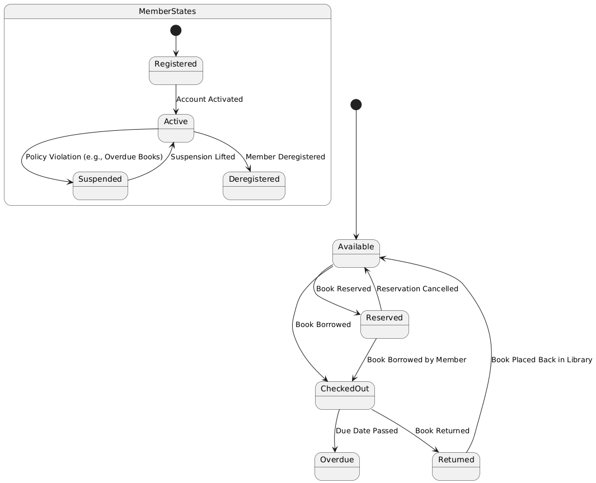

# Exercise 08

## Drawing State Chart Diagram for Library Management System

### Aim  

To draw the State Chart Diagram for a Library Management System.

### Theory

A **State Chart Diagram** in UML is used to describe the states of an object throughout its life cycle and the events that trigger state transitions. In the context of a **Library Management System**, the diagram will focus on the states and transitions of key entities like `Book`, `Member`, and `Loan`.

For example, a book in the library may go through states such as "Available", "Checked Out", "Reserved", and "Returned". Similarly, a library member may go through states like "Registered", "Active", and "Suspended".

### Procedure/Program

1. **Identify States**:
   - **Book States**:
     - **Available**: The book is in the library and available for borrowing.
     - **Checked Out**: The book has been borrowed by a member.
     - **Reserved**: The book is reserved by a member and cannot be checked out by others.
     - **Returned**: The book has been returned to the library.
     - **Overdue**: The book has passed the due date for return.

   - **Member States**:
     - **Registered**: The member has registered in the library system.
     - **Active**: The member is in good standing and can borrow books.
     - **Suspended**: The member’s borrowing privileges are suspended, perhaps due to overdue books or policy violations.
     - **Deregistered**: The member is no longer part of the library system.

2. **Define Transitions**:
   - **Book Transitions**:
     - From **Available** to **Checked Out**: Triggered when a member borrows a book.
     - From **Checked Out** to **Returned**: Triggered when the book is returned.
     - From **Checked Out** to **Overdue**: Triggered when the book is not returned by the due date.
     - From **Available** to **Reserved**: Triggered when a member reserves the book.
     - From **Reserved** to **Checked Out**: Triggered when the reserved book is borrowed by the member.
     - From **Reserved** to **Available**: Triggered if the reservation is canceled.
     - From **Returned** to **Available**: Triggered when the book is successfully returned and placed back in the library.

   - **Member Transitions**:
     - From **Registered** to **Active**: Triggered when the member’s account is activated.
     - From **Active** to **Suspended**: Triggered if the member violates library policies, such as returning books late.
     - From **Suspended** to **Active**: Triggered when the member’s suspension is lifted, allowing them to borrow books again.
     - From **Active** to **Deregistered**: Triggered when the member decides to leave or is removed from the library system.

3. **Draw the State Chart Diagram**:
   - Represent each state as a rounded rectangle.
   - Use arrows to represent transitions between states.
   - Label each transition with the event that causes the state change.
   - Indicate conditions that might affect transitions, such as overdue fines or book availability.

### Output/Explanation

- **State Chart Diagram**:
  - The output will be a state chart diagram showing the different states for both `Book` and `Member`, as well as the transitions between them.

**Example** of states and transitions for a `Book`:

- **Available** → **Checked Out** → **Returned** → **Available**.
- **Available** → **Reserved** → **Checked Out** → **Returned** → **Available**.
- **Checked Out** → **Overdue**.

**Example** of states and transitions for a `Member`:

- **Registered** → **Active** → **Suspended** → **Active** → **Deregistered**.

Explanation:

- The **State Chart Diagram** models the dynamic behavior of both `Books` and `Members` in the Library Management System.
- It captures how books change states based on actions like being borrowed, returned, or reserved, and how members move between states such as active, suspended, or deregistered.

This diagram is useful in understanding the flow of operations within a library system, particularly how transactions affect both books and members over time.
