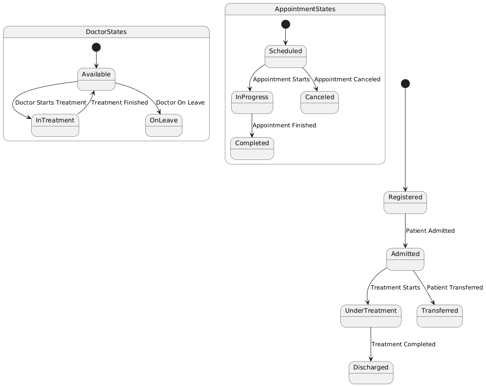

# Exercise 09

## Drawing State Chart Diagram for Hospital Management System

### Aim  

To draw the State Chart Diagram for a Hospital Management System.

### Theory

A **State Chart Diagram** in UML is used to describe the states of an object and the events that trigger transitions between those states. In a **Hospital Management System**, the diagram focuses on the dynamic behavior of key entities such as `Patient`, `Doctor`, `Appointment`, and `Treatment`.

For example, a patient in the hospital may go through states such as "Admitted", "Under Treatment", "Discharged", and "Transferred". A doctor may go through states like "Available", "In Treatment", and "On Leave".

### Procedure/Program

1. **Identify States**:
   - **Patient States**:
     - **Registered**: The patient has been registered in the hospital system.
     - **Admitted**: The patient has been admitted to the hospital for treatment.
     - **Under Treatment**: The patient is receiving treatment or undergoing surgery.
     - **Discharged**: The patient has completed their treatment and is being discharged from the hospital.
     - **Transferred**: The patient is being transferred to another department or hospital.

   - **Doctor States**:
     - **Available**: The doctor is available for consultation or treatment.
     - **In Treatment**: The doctor is engaged in providing treatment to a patient.
     - **On Leave**: The doctor is unavailable due to personal leave or vacation.

   - **Appointment States**:
     - **Scheduled**: An appointment with a doctor has been scheduled for a patient.
     - **In Progress**: The appointment is currently taking place.
     - **Completed**: The appointment has concluded, and the patient's consultation or treatment is finished.
     - **Canceled**: The scheduled appointment was canceled by the patient or doctor.

2. **Define Transitions**:
   - **Patient Transitions**:
     - From **Registered** to **Admitted**: Triggered when a patient’s condition requires hospitalization.
     - From **Admitted** to **Under Treatment**: Triggered when treatment begins.
     - From **Under Treatment** to **Discharged**: Triggered when the treatment is completed, and the patient is ready for discharge.
     - From **Admitted** to **Transferred**: Triggered if the patient needs to be moved to a different department or hospital.

   - **Doctor Transitions**:
     - From **Available** to **In Treatment**: Triggered when the doctor starts treating a patient.
     - From **In Treatment** to **Available**: Triggered when the treatment is over, and the doctor is free.
     - From **Available** to **On Leave**: Triggered when the doctor goes on vacation or is unavailable.

   - **Appointment Transitions**:
     - From **Scheduled** to **In Progress**: Triggered when the appointment time arrives, and the consultation begins.
     - From **In Progress** to **Completed**: Triggered when the appointment is completed.
     - From **Scheduled** to **Canceled**: Triggered when the appointment is canceled by the patient or doctor.

3. **Draw the State Chart Diagram**:
   - Represent each state as a rounded rectangle.
   - Use arrows to represent transitions between states.
   - Label each transition with the event that causes the state change.
   - Indicate any conditions that might affect transitions, such as doctor availability or appointment cancellations.

### Output/Explanation

- **State Chart Diagram**:
  - The output will be a state chart diagram showing the different states for `Patient`, `Doctor`, and `Appointment`, as well as the transitions between them.

**Example** of states and transitions for a `Patient`:

- **Registered** → **Admitted** → **Under Treatment** → **Discharged**.
- **Admitted** → **Transferred** → **Admitted** (in another department or hospital).
- **Under Treatment** → **Discharged**.

**Example** of states and transitions for a `Doctor`:

- **Available** → **In Treatment** → **Available**.
- **Available** → **On Leave** → **Available**.

**Example** of states and transitions for an `Appointment`:

- **Scheduled** → **In Progress** → **Completed**.
- **Scheduled** → **Canceled**.

Explanation:

- The **State Chart Diagram** models the dynamic behavior of patients, doctors, and appointments in the Hospital Management System.
- It highlights how a patient progresses from being registered to receiving treatment and being discharged, and how the doctor moves between being available, treating patients, and taking leave.
- The appointment states show the lifecycle of an appointment, from scheduling to completion or cancellation.

This diagram is valuable for understanding the flow of activities in a hospital, helping to improve operational efficiency and patient care.
