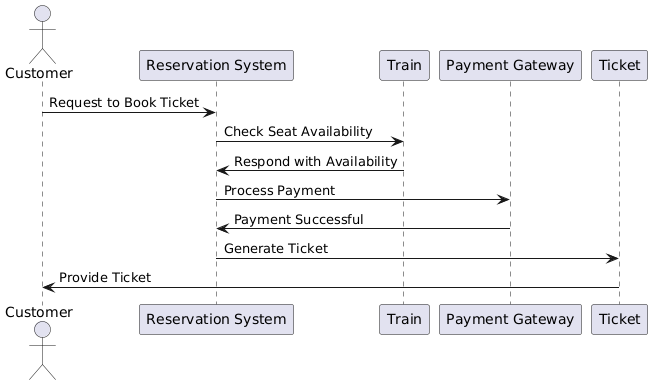

# Exercise 10

## Drawing Interaction Diagrams for Railway Reservation System

### Aim  

To draw the Interaction Diagrams for a Railway Reservation System.

### Theory

An **Interaction Diagram** in UML represents the interactions between objects in a system through messages. It shows how objects collaborate to perform a particular task or operation.

There are two main types of interaction diagrams:

1. **Sequence Diagram**: Focuses on the sequence of messages exchanged between objects over time.
2. **Communication Diagram**: Focuses on the interactions and the relationships between objects.

For a **Railway Reservation System**, interaction diagrams can model processes like booking tickets, checking seat availability, and handling payment.

### Procedure/Program

1. **Identify Objects Involved**:
   - **Customer**: The user who wants to book tickets.
   - **Reservation System**: The main system that handles the ticket booking process.
   - **Train**: Represents the train for which the booking is being done.
   - **Payment Gateway**: Processes the payment after ticket booking.
   - **Ticket**: The object representing the booked ticket.

2. **Define Use Cases**:
   - **Book Ticket**: The customer requests a ticket for a particular train.
   - **Check Availability**: The system checks if seats are available on the requested train.
   - **Make Payment**: After booking, the customer makes payment for the ticket.
   - **Generate Ticket**: Once payment is successful, the system generates a ticket for the customer.

3. **Sequence Diagram**:
   A sequence diagram will show the interactions between objects in the **Book Ticket** use case.

   Steps in the **Book Ticket** use case:
   - The **Customer** requests to book a ticket.
   - The **Reservation System** asks the **Train** for seat availability.
   - The **Train** checks the seat availability and responds to the **Reservation System**.
   - The **Reservation System** asks the **Payment Gateway** to process the payment.
   - The **Payment Gateway** processes the payment and informs the **Reservation System**.
   - The **Reservation System** generates a **Ticket** for the customer.

4. **Communication Diagram**:
   A communication diagram will show the same interactions but in a different layout, focusing on the relationships between the objects.

### Output/Explanation



- **Sequence Diagram**:
  - The sequence diagram will show the time-sequenced interaction between the customer, reservation system, train, payment gateway, and ticket.
  - It will be represented as a vertical timeline for each object, with horizontal arrows showing messages or operations between them.

**Example Sequence Diagram** for the **Book Ticket** use case:

```bash
Customer          Reservation System          Train           Payment Gateway           Ticket
    |                      |                     |                       |                  |
    |   Request Ticket     |                     |                       |                  |
    |--------------------->|                     |                       |                  |
    |                      |                     |                       |                  |
    |                      |   Check Availability|                       |                  |
    |                      |-------------------->|                       |                  |
    |                      |                     |   Check Seats         |                  |
    |                      |                     |---------------------->|                  |
    |                      |                     |                       |                  |
    |                      |   Seats Available   |                       |                  |
    |                      |<--------------------|                       |                  |
    |                      |                     |                       |                  |
    |                      |   Process Payment   |                       |                  |
    |                      |-------------------->|                       |                  |
    |                      |                     |   Process Payment     |                  |
    |                      |                     |---------------------->|                  |
    |                      |                     |                       | Payment Confirmed|
    |                      |                     |                       |<-----------------|
    |                      |   Generate Ticket   |                       |                  |
    |                      |-------------------->|                       |                  |
    |                      |                     |                       |                  |
    |                      |   Ticket Generated  |                       |                  |
    |                      |<--------------------|                       |                  |
```

- **Communication Diagram**:
  The communication diagram will show the same steps as the sequence diagram but in a network layout with objects as nodes and messages as numbered arrows.

**Example Communication Diagram** for the **Book Ticket** use case:

```bash
[Customer] --> [Reservation System]: Request Ticket
[Reservation System] --> [Train]: Check Availability
[Train] --> [Reservation System]: Availability Response
[Reservation System] --> [Payment Gateway]: Process Payment
[Payment Gateway] --> [Reservation System]: Payment Confirmation
[Reservation System] --> [Ticket]: Generate Ticket
[Ticket] --> [Customer]: Ticket Generated
```

Explanation:

- The **Sequence Diagram** represents the interaction sequence over time, showing the objects involved in booking a railway ticket and the operations triggered at each step.
- The **Communication Diagram** provides a more static view, focusing on the relationships between the objects involved in the process.

These diagrams help visualize the flow of messages and interactions required to complete the ticket booking process, ensuring that the system functions smoothly and efficiently.
